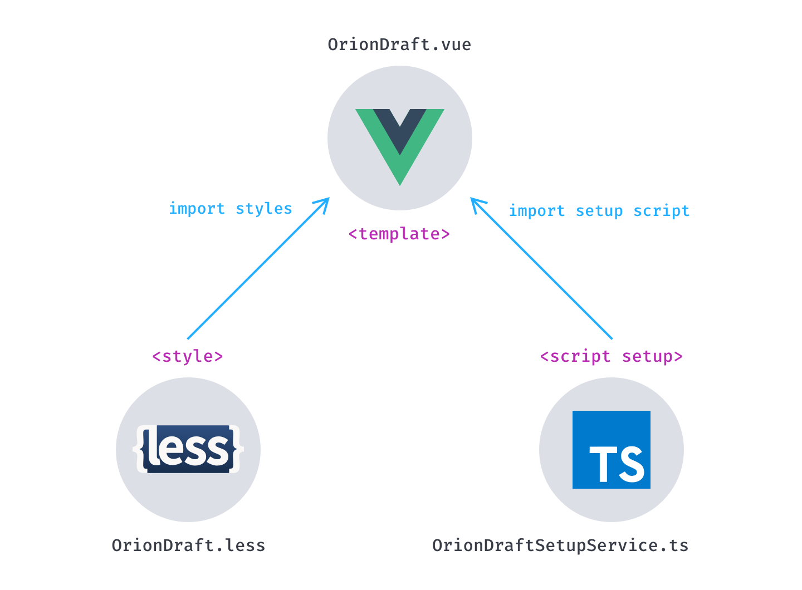
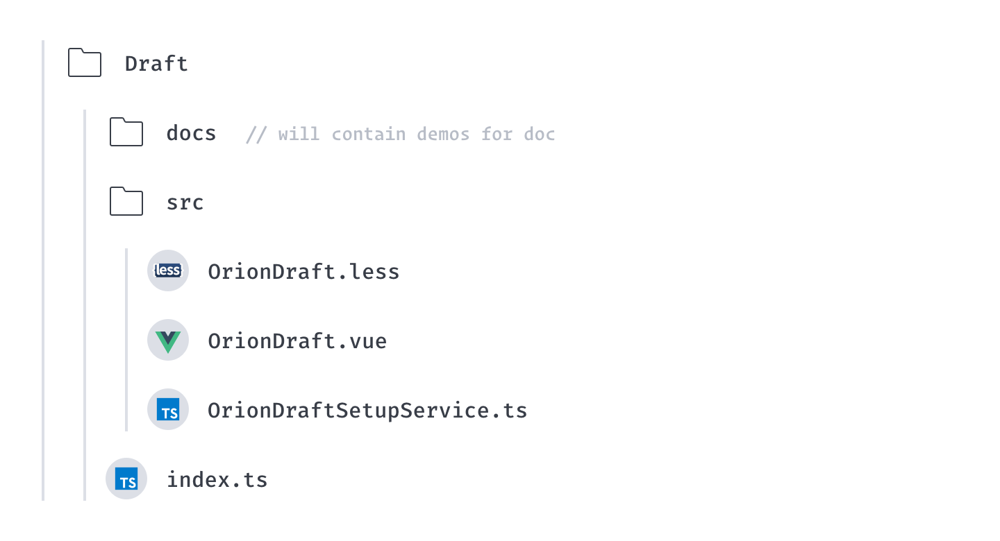
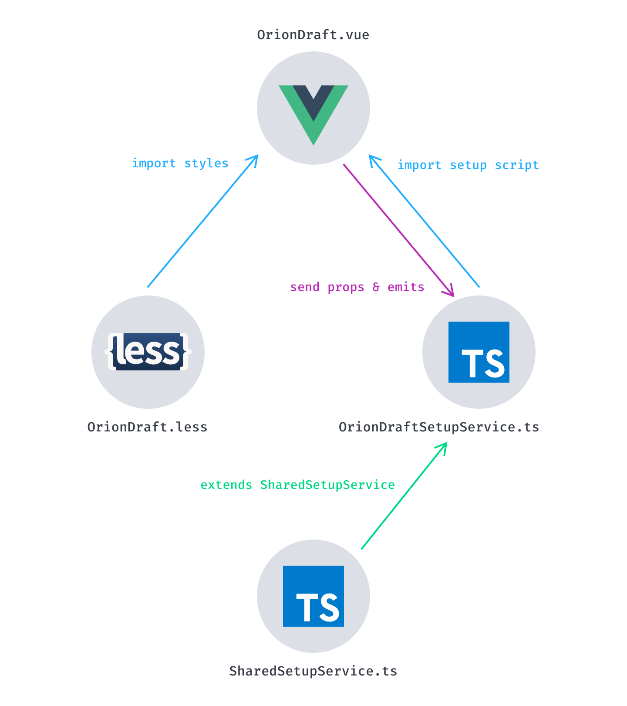

# Creating a new component

**Orion** provide a simple **command line interface** to enhance the DX when contributing to the projet.\
This `cli` will take care of scaffolding a new component by creating the necessary files in the right place.

Don't worry, we use a pretty common architecture with only a slight change on the `script` part that we explain below.

## Our package design philosophy

The design is pretty basic, it follows the below schema.

::: tip
In order to easy understand the mechanism, let's consider creating a **Draft** component.
:::

<div class="img--schema">



</div>

### Keep the code clean

The code is divided in 3 files.

<div class="flex-list">

- <p>The `template` part obviously stays in the `.vue` file.</p>
- <p>The `style` part takes place in a separate `.less` file. It aims at keeping the code cleaner and avoid `scoped style` which make styles overriding easier for people who use **Orion** and want to customize it.</p>
- <p>The `script` part goes in a `.ts` file. This was a hard choice because it's not yet fully supported by Vue.js. Nevertheless it enables us to take full advantage of using typescript features, and specifically classes and inheritance. More on that in the [Enhance DX section](#enhance-dx).</p>

</div>

### Enhance DX (Developer Experience)

As said many times, we care about DX. That's one of the reasons why we chose to put all the script part in a dedicated typescript `class` for each component.

This design pattern makes `class` and `inheritance` usage a breathe. It also contribute to maintain a clean code, **even inside the template**.

**_Wondering how is this possible ?_**

You juste have to use `private` or `protected` attributes in your `SetupService` class to prevent them from being accessible in template.\
For example, if you use VSCode, you'll have a cleaner **Intellisense**. It helps reducing errors and code complexity while developing your application.

But let's dive into a more concrete example.

## The component creation process

We don't want to bore people with naming convention and folder structure. That's why we created a small `cli` to make the process easier.

```sh:no-line-numbers
# In Orion root
node cli.cjs
```

<br>

Select the `package` option.

```:no-line-numbers{3}
┌  
🥨 --> Welcome to Orion CLI
│
◆  Select what you want to do
│  ○ Volar Intellisense
│  ● New package (Scaffold a new package)
│  ○ Create packages index
│  ○ Create services index
│  ○ Create sandbox routes
│  ○ Build lib
│  ○ Create doc's data files
└
```

<br>

The you have to enter the name of your package.

```:no-line-numbers{2}
┌  
🥨 --> Welcome to Orion CLI
│
◇  Select what you want to do
│  New package
│
◆  What's the name of your package?
│  Package name
└
```

::: tip
Don't worry about the naming convention, juste enter the name.\
It will be automatically converted to **PascalCase** and prefixed with _Orion_.
:::

```:no-line-numbers{2}
┌  
🥨 --> Welcome to Orion CLI
│
◇  Select what you want to do
│  New package
│
◇  What's the name of your package?
│  draft
│
◆  🥨 --> Orion created /packages/Draft/index.ts
│
◆  🥨 --> Orion created /packages/Draft/src/OrionDraft.vue
│
◆  🥨 --> Orion created /packages/Draft/src/OrionDraft.less
│
◆  🥨 --> Orion created /packages/Draft/src/OrionDraftSetupService.ts
│
◆  🥨 --> Orion created /docs/components/OrionDraft.md
│
◆  🥨 --> Orion created /packages/index.ts
│
◆  🥨 --> Orion created /lib/packages.d.ts
│
◆  Enter the prefix for Orion components?
│  o_
└
```

The `volar` command is then automatically executed to recreate the `orion-volar.d.ts` file with your new component ([more infos on `volar` command](../guide/volar.md)).

### Package files

The following folder structure will be generated by the `package` command.

\


<br>

::: tip
These are the 3 main files in which you'll write your code.
:::

:::: code-group
::: code-group-item OrionDraft.vue

```vue
<template>
	<pre>OrionDraft</pre>
</template>

<script setup lang="ts">
import './OrionDraft.less';
import OrionDraftSetupService from './OrionDraftSetupService';
const props = defineProps(OrionDraftSetupService.props);
const setup = new OrionDraftSetupService(props);
defineExpose(setup.publicInstance);
</script>
```

:::

::: code-group-item OrionDraftSetupService.ts

```ts
import SharedSetupService from '../../Shared/SharedSetupService';
import SharedProps from '../../Shared/SharedProps';

type Props = SetupProps<typeof OrionDraftSetupService.props>;

export default class OrionDraftSetupService extends SharedSetupService<Props> {
	static props = {};

	constructor(props: Props) {
		super(props);
	}
}
```

:::

::: code-group-item OrionDraft.less

```less
@import '../../Shared/styles/variables.less';
@import '../../Shared/styles/mixins.less';

.orion-draft {
}
```

:::
::::

### Package structure

<div class="img--schema">



</div>

::: tip SharedSetupService.ts
Every `SetupService` extends the `SharedSetupService` class. _So, you get the idea..._

If something is needed in every component, the `SharedSetupService` will be the right place to put the code in.
:::

### Documentation

Once you've created your new component, don't forget to add documentation for it.

The `package` command also created the following file : `/docs/components/OrionDraft.md`

Writing documentation is hard, just try to do your best to explain how your component works, when it can be used, what specific situations it can handle.

#### Demos

As you probably noticed, every package has a `docs` folder. It will contains the `.vue` files for each demos or playground that you want to put in your documentation.

We created a Vuepress/Markdown plugin to easily integrate these demos in the mardown files.

At the end of your code the `.vue` file, you can add a small descriptionn concerning the demo.
To do so, just use the `@lang:` marker followed by one of the supported languages of the documentation (`en` for english is required). You can see an example bellow.
<br>

Take for example the [OrionButton documentation](../components/OrionButton.md), you'll find the following lines :

```md:no-line-numbers
::: demo:Button
ButtonColors
ButtonIcons
ButtonPlayground
:::
```

<br>

Basically, the first line is the marker that will tell the bundler to integrate demos at this point.\
When parsing the source files, the regex will search for the following expression : `::: demo:`\
If we take our **Draft** component example :

```md:no-line-numbers{1}
::: demo:Draft
```

<br>

Then you just need to specify which demo you want to insert (by writing the demo's file name) :

```md:no-line-numbers{2-4}
::: demo:Draft
DraftDemo1
DraftDemo2
DraftDemo3
::: <!-- don't forget to close the demo marker with ::: -->
```

Then at the end of your `.vue` file, you must add a quick description which must have a certain template :

```vue:no-line-numbers
@lang:en
### Title of your demo

Description
@lang
```

#### Adding your documentation in the menu

The final step is to add a link to the documentation page in the **sidebar**.\
Add your file's path in one of the `children` array in `docs/.vuepress/configs/sidebar/index.ts`\
The good location will depend on the category of your component.
