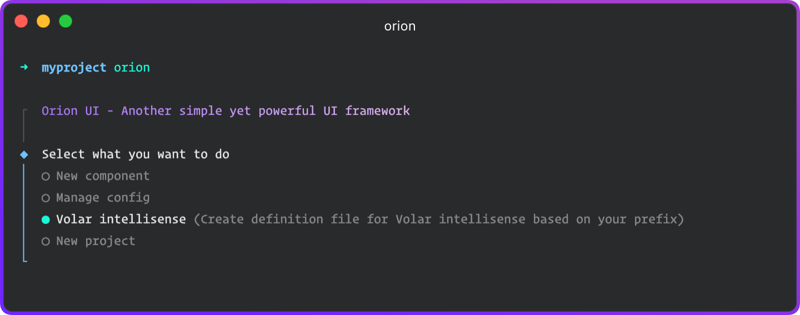
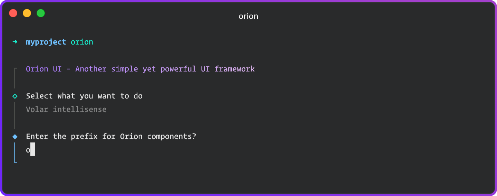
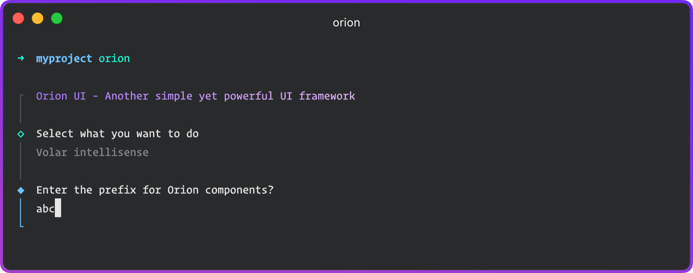

# Volar

[Volar](https://marketplace.visualstudio.com/items?itemName=Vue.volar) is a popular VSCode extension that add language support for Vue.
It can add auto-completion and type checking to components props right in the `<template>`

It is possible to benefits from these features with Orion's components by adding a type definition file in the `src` folder of your project.

This is made easy using [**Orion CLI**](https://github.com/orion-ui/orion-cli):



... and enter the prefix for Orion components (press **Enter** to use default 'o').\
This prefix must obviously be the same as the one in [Orion config](quick-start.md#configuration-options).\
You can see an example with a custom prefix [below](#custom-prefix).



This command will create a `orion-volar.d.ts` file with the appropriate content.

::: code-tabs
@tab orion-volar.d.ts

```ts
declare module 'vue' {
	export interface GlobalComponents {
		OAlert: typeof import('@orion.ui/orion/dist/types/packages')['OrionAlert'];
		OAside: typeof import('@orion.ui/orion/dist/types/packages')['OrionAside'];
		...
		OUpload: typeof import('@orion.ui/orion/dist/types/packages')['OrionUpload'];
	}

  export interface ComponentCustomProperties {}
}

export {};
```

:::

## Custom prefix

::: tip
If you've configured **Orion** with a custom prefix for the components, you can add the `--prefix` option to this command.
:::

::: code-tabs
@tab main.ts

```ts{2}
createApp(App)
  .use(Orion, { prefix: 'abc' } as Orion.Config)
  .mount('#app')
```

:::




::: code-tabs
@tab orion-volar.d.ts

```ts{3,4,6}
declare module 'vue' {
	export interface GlobalComponents {
		AbcAlert: typeof import('@orion.ui/orion/dist/types/packages')['OrionAlert'];
		AbcAside: typeof import('@orion.ui/orion/dist/types/packages')['OrionAside'];
		...
		AbcUpload: typeof import('@orion.ui/orion/dist/types/packages')['OrionUpload'];
	}

  export interface ComponentCustomProperties {}
}

export {};
```

:::
